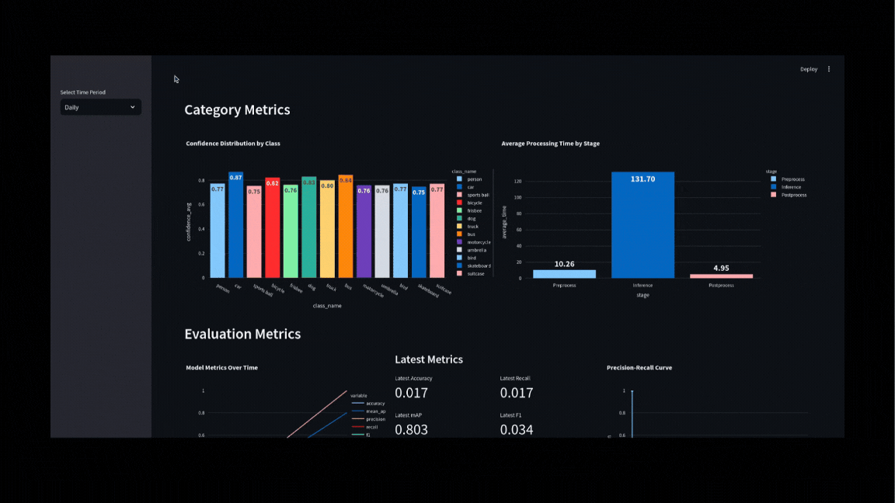

# Traffic Analysis
This project aims to perform real-time traffic analysis using computer vision techniques to detect and analyze vehicles, pedestrians, bikes, and other objects in a video stream. The project utilizes the YOLOv8 model for object detection and stores the detected data in a NoSQL database (MongoDB) for further processing and analysis.

## Overview
The traffic analysis system is designed to capture and process real-time video feeds. Using the YOLOv8 model for object detection, the system identifies different types of objects such as cars, bikes, and people, and stores this data in MongoDB for further analysis. The goal is to provide insights into traffic patterns and help in decision-making processes such as traffic flow improvements.

## Features

- **Real-time Object Detection**: Detects vehicles, bikes, pedestrians, and other objects in live video streams using YOLOv8.
- **Data Storage in MongoDB**: All detected objects and their metadata are stored in a MongoDB database.
- **ETL Pipeline Optimization**: Efficient extraction, transformation, and loading of data from video streams.
- **Automated Reporting and Insights Generation**: Generate automated reports based on historical and live data.
- **Real-time Dashboard and Visualization**: A dashboard to visualize live and historical traffic data with graphical representations.
- **Dockerized Deployment**: Containerize the application for easy deployment and scalability.

## Implementations

- **Automated Reporting and Insights Generation**: Implemented logic to automatically generate reports based on traffic data trends.
- **Real-time Dashboard and Visualization**: Developed a dashboard that shows live traffic updates, trends, and historical data analysis using visualization libraries like Plotly and Streamlit.


## Dashboard showcase


## Technologies Used

- **Computer Vision**: YOLOv8 for object detection.
- **Database**: MongoDB for storing object data.
- **Python Libraries**:
  - `opencv` for video processing.
  - `pymongo` for MongoDB interaction.
  - `pytorch` for handling YOLOv8 models.
  - `ssh_pymongo` for SSH connection to remote MongoDB instances.
  - `pandas` for data manipulation and analysis.
  - `streamlit` for creating the real-time dashboard.
  - `Plotly` for creating interactive visualizations.


## Getting Started

### Prerequisites

- Python 3.8 or higher
- MongoDB instance
- Docker (optional, for containerized deployment)

### Installation

1. Clone the repository:
    ```sh
    git clone https://github.com/yourusername/traffic_analysis.git
    cd traffic_analysis
    ```

2. Install the required Python packages:
    ```sh
    pip install -r requirements.txt
    ```

3. Run the application:
    ```sh
    python src/main.py
    ```

## Future Implementations

- **Containerized Deployment**: Use Docker to containerize the application, ensuring easy deployment and scalability.
- **Evaluation Metric Improvements**: Develop and integrate more sophisticated evaluation metrics to better assess the performance of the object detection and tracking algorithms.
- **Scalability Improvements**: Enhance the scalability of the system to handle larger datasets and more video streams simultaneously.
- **Active Learning**: Implement active learning techniques to continuously improve the object detection model by retraining it with new data. This will help in adapting the model to different environments and improving its accuracy over time.
